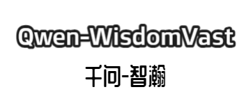

<p align="center">
<a href='https://huggingface.co/spaces/zhichen'>

</a>
</p>

<div align="center">
  <p align="center">
    <h3> Qwen-WisdomVast (千问-智瀚)</h3>

<p align="center">
      <a href='https://huggingface.co/spaces/zhichen'>
        
      </a>
      <a href=href="https://github.com/seanzhang-zhichen/Qwen-WisdomVast/stargazers">
        
      </a>
      <a href="https://github.com/seanzhang-zhichen/Qwen-WisdomVast/blob/main/LICENSE">
        
      </a>
</p>
</div>


## 介绍

Qwen-WisdomVast是以Qwen1.5-7B为底座，使用 [DORA](https://arxiv.org/pdf/2402.09353.pdf) + [LORA+](https://arxiv.org/pdf/2402.12354.pdf) 的训练方法，在100w高质量中文多轮SFT数据 + 20w英文多轮SFT数据 + 2000单轮自我认知数据训练而来的大模型，数学能力相比Qwen1.5-7B-Chat提升了5.56%，在HumanEval数据集上相比Qwen1.5-7B-Chat提升了4.27%，在MBPP数据集上提升了14.6%，在BBH数据集上提升了11.77%，全部评测表现见下表。

## 评测表现

| Model             | MMLU  | C-Eval | GSM8K | MATH  | HumanEval | MBPP  | BBH   |
|-------------------|-------|--------|-------|-------|-----------|-------|-------|
| Qwen-7B           | 58.2  | 63.5   | 51.7  | 11.6  | 29.9      | 31.6  | 45.0  |
| Qwen1.5-7B-Chat   | 60.88 | 70.18  | 54.13 | 7.96  | 31.10     | 15.00 | 31.67 |
| Qwen-WisdomVast   | 56.78 | 68.17  | 53.45 | 13.58 | 35.37     | 29.60 | 43.44 |

说明：

Qwen-7B的评测结果来自[Qwen官方仓库](https://github.com/QwenLM/Qwen)

由于官方并未公布Qwen1.5-7B-Chat的评测表现，所以我们自己使用opencompass脚本测试得到以上结果

Qwen-WisdomVast使用和Qwen1.5-7B-Chat一样的参数进行测试

## 合并LORA模型

1、下载 [Qwen1.5-7B](https://modelscope.cn/models/qwen/Qwen1.5-7B/summary) 模型

```bash
git clone https://www.modelscope.cn/qwen/Qwen1.5-7B.git
```

2、下载[Qwen-WisdomVast-Lora](todo)

```bash
# TODO
```

3、合并模型

```bash
python merge_lora.py \
    --base_model path/to/qwen/Qwen1.5-7B \
    --lora_model path/to/lora/Qwen-WisdomVast-Lora \
    --output_dir ./Qwen-WisdomVast
```

## 命令行推理

```bash
python cli_demo.py  --model_path ./Qwen-WisdomVast
```

## web 推理

```bash
python web_demo.py  --model_path ./Qwen-WisdomVast
```


## vllm web 推理

1、使用[vllm](https://github.com/vllm-project/vllm)部署模型

```bash
python -m vllm.entrypoints.openai.api_server --served-model-name Qwen-WisdomVast --model ./Qwen-WisdomVast(换成你自己的合并后的模型路径)
```

2、在命令行执行

```bash
python vllm_web_demo.py --model Qwen-WisdomVast 
```


## 复现测试结果

1、使用[vllm](https://github.com/vllm-project/vllm)部署`openai api server`

部署命令:

```bash
python -m vllm.entrypoints.openai.api_server --served-model-name Qwen-WisdomVast --model /model/Qwen-WisdomVast(换成你自己的合并后的模型路径)
```

2、使用[opencompass](https://github.com/open-compass/opencompass)框架进行测试

想要复现测试结果的同学可以参考以下文章：

[使用opencompass验证模型效果](https://blog.csdn.net/qq_44193969/article/details/134979054)

按照以上文章修改好后，将`eval_qwen_wisdomvast.py`文件到 `opencompass/configs`文件夹下


3、执行测试脚本

```bash
python run.py configs/eval_qwen_wisdomvast.py  -w outputs/Qwen-WisdomVast
```

## LICENSE

本项目仅可应用于研究目的，项目开发者不承担任何因使用本项目（包含但不限于数据、模型、代码等）导致的危害或损失。详细请参考[免责声明](https://github.com/seanzhang-zhichen/Qwen-WisdomVast/blob/main/DISCLAIMER)。

Qwen-WisdomVast项目代码的授权协议为 [The Apache License 2.0](.//LICENSE)，代码可免费用做商业用途，模型权重和数据只能用于研究目的。请在产品说明中附加Qwen-WisdomVast的链接和授权协议。

## Citation

如果你在研究中使用了Qwen-WisdomVast，请按如下格式引用：

```latex
@misc{Qwen-WisdomVast,
  title={Qwen-WisdomVast},
  author={Zhichen Zhang, Weihan Huang},
  year={2024},
  howpublished={\url{https://github.com/seanzhang-zhichen/Qwen-WisdomVast}},
}
```


## Acknowledgement

[QwenLM/Qwen1.5](https://github.com/QwenLM/Qwen1.5)
<br>
[hiyouga/LLaMA-Factory](https://github.com/hiyouga/LLaMA-Factory)
<br>
[shibing624/MedicalGPT](https://github.com/shibing624/MedicalGPT)